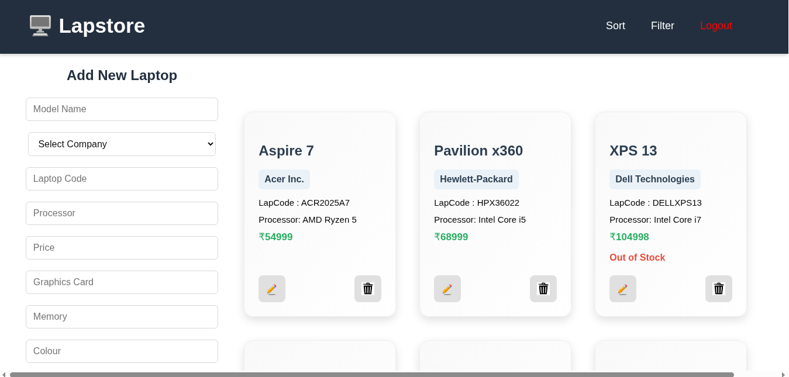

# 💻 Laptop Management App

A full-stack web application for managing laptop inventories, built with **React.js** on the frontend and **Spring Boot** on the backend. It allows users to add, edit, filter, sort, and delete laptops, with detailed modal views for each item.

---

## 🚀 Features

- ✅ Add, Edit, and Delete laptop entries
- ✅ View laptops in a card-based layout
- ✅ Sort by price and availability
- ✅ Filter laptops dynamically
- ✅ Responsive modal with detailed specifications
- ✅ Backend integration using Axios with RESTful API
- ✅ Status tracking for stock (Available / Out of Stock)

---

## 🛠️ Tech Stack

### Frontend:
- React.js
- Axios
- React Toastify (notifications)
- CSS Modules

### Backend:
- Spring Boot
- Java
- REST API
- H2 / MySQL Database

---

## 📸 Screenshots

### 📋 Home View

---

### Prerequisites
- Node.js & npm
- Java (17+)
- Maven
- Git

